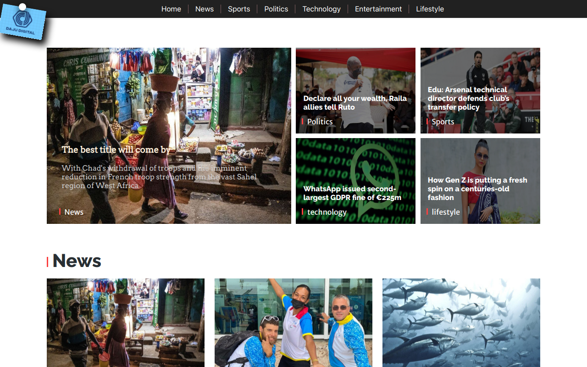

<h1>About the project</h1>
This is a news website. As simple as it is. users are able to add blog post in real time. It supports image and video embedding.
It is connect by aws which is used to search media files to headless wordpress backhead which is then displayed by nextjs frontend.

<h2>Build with</h2>

This website is build with:

<ul>
 <li>Nextjs</li>
<li>wordpress</li>
<ul>

<h2>Screenshot</h2>

<h2>Licence</h2>

Distributed under the MIT Licence

<h2>Contact</h2>

my email: [ndemorich@gmail.com](ndemorich@gmail.com)

project Link: [https://dajudigital.vercel.app/](https://dajudigital.vercel.app/)

<h2>Acknowledgements</h2>

<ul>
<li>vercel</li>
<li>AWS</li>
<li>wordpress</li>
</ul>
